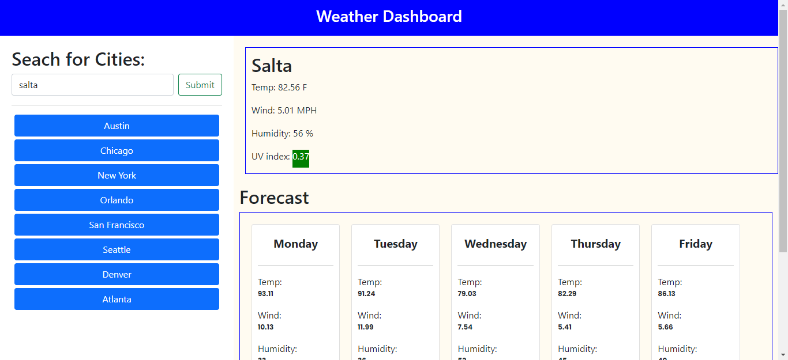

# Weather Dashboard App
  
  
  ## Description
  This is an application that you can use to find the weather anywhere around the world. In this application, the API used to gather the data comes from OpenWeatherMap.org. The specific API's used from the site are the "CurrentWeather API" and the "OneCall API". You can also check ot some of the other parameters that are affecting the temperature along with getting the forecast for the rest of the week. This is helpful if you want to quickly access information about a city you may be visiting and it's weather conditions.

  ## Table of Contents
  [ Description](#description)

  [ Installation](#installation)

  [ Usage](#usage)

  [ Contributing](#contributing)

  [ Tests](#tests)

  [ Questions](#questions)

  ## Installation
  Moments is an dependency used to format the date data from the api's forecast information.

  ## Usage
 

  ## Contributing
  There could be more temperature parameters added to project that may be useful for users depending on their needs.

  ## Tests
  No commends needed, you can type in the city you would like to look up in the search bar or click one of the pre set city buttons on the side.
  
  ## Questions

  Link: https://kilowattdot.github.io/WeatherApp

  Email: Dot.Gilchrist95@gmail.com

   

